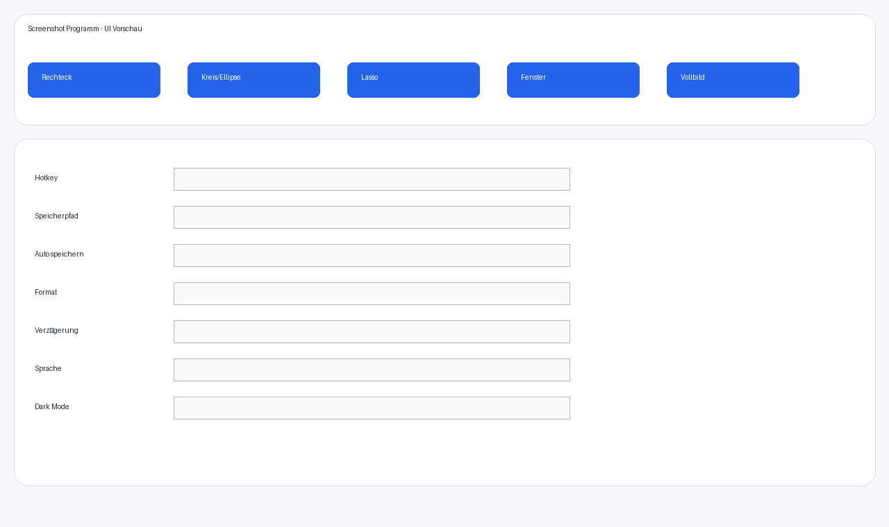

# Screenshot-Programm (C# / WPF)

Professionelles Windows Screenshot-Tool mit globalem Hotkey, mehreren Auswahlformen, Editor, Systemtray und konfigurierbaren Einstellungen.



## Features

- **Globaler Hotkey** (Standard: `Strg + Shift + S`, anpassbar)
- **Aufnahme-Modi**
  - Rechteck
  - Kreis/Ellipse
  - Lasso (Freihand)
  - Fenster-Erkennung (aktives Fenster)
  - Vollbild
- **Einstellungsmenü**
  - Hotkey (Modifier + Taste)
  - Speicherpfad
  - Automatisches Speichern
  - Format: PNG / JPG / BMP
  - Verzögerung vor Aufnahme
  - Screenshot-Sound
  - Sprache DE/EN
  - Dark Mode
- **Screenshot-Editor vor dem Speichern**
  - Text-Tool
  - Rechteck / Ellipse / Pfeil
  - Farbauswahl
  - Blur-Werkzeug
  - Tastaturkürzel: `Esc` (Abbrechen), `Enter` (Speichern)
- **Systemtray-Integration**
  - Start im Tray
  - Direkte Aufnahme
  - Öffnen / Beenden
- **Verwaltung**
  - Auto-Speicherung mit Zeitstempel
  - Letzten Screenshot in Zwischenablage kopieren
  - Screenshot-Ordner öffnen

## Architektur

- **WPF + C# (.NET 8)**
- MVVM-orientierter Aufbau (`ViewModels/MainViewModel.cs`)
- Services für Settings, Lokalisierung, Hotkeys, Capture
- JSON-Konfigurationsdatei unter `%AppData%/ScreenshotProgramm/settings.json`

## Voraussetzungen

- Windows 10/11
- .NET 8 SDK oder Runtime mit WindowsDesktop-Unterstützung

## Build

```bash
dotnet restore ScreenshotProgramm.slnx
dotnet build ScreenshotProgramm.slnx
```

## Start

```bash
dotnet run --project /home/runner/work/Screenshot-programm/Screenshot-programm/ScreenshotProgramm/ScreenshotProgramm.csproj
```

## Bedienung

1. App startet im Systemtray.
2. Screenshot per Tray-Menü oder Hotkey auslösen.
3. Auswahl treffen (je nach Modus).
4. Im Editor bearbeiten und mit Enter speichern.
5. Bei aktiviertem Auto-Save wird mit Zeitstempel gespeichert.

## Hinweise

- Der globale Hotkey wird nach Änderungen in den Einstellungen sofort neu registriert.
- Bei inaktivem Auto-Save bleibt der Screenshot in der Zwischenablage verfügbar.
